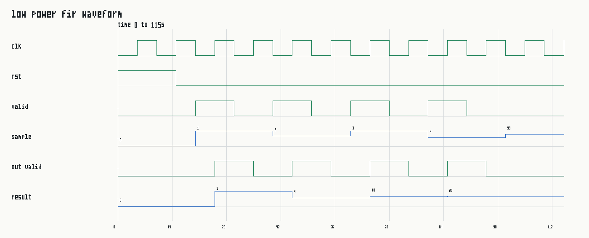
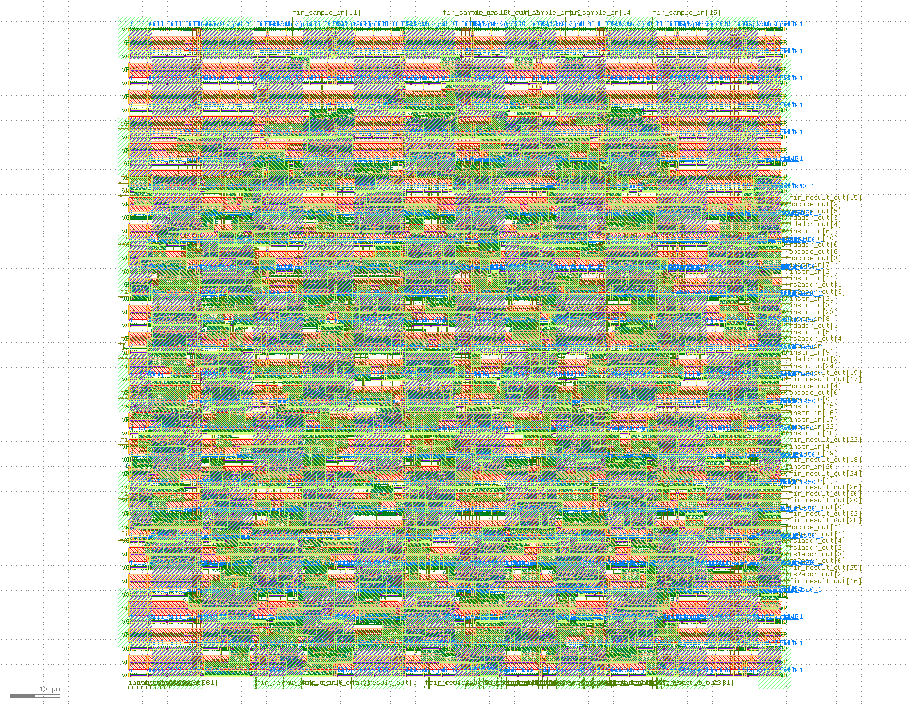

# RISC-V Core + Low-Power FIR Accelerator

This repository contains project work for **"Synergising RISC-V Core with Low Power FIR Filtering on FPGA for Enhanced Processing Efficiency"**.

The design combines basic RISC-V decode/register-file building blocks with a clock-enable controlled FIR accelerator that is suitable for FPGA experiments.

## What Is Included

- RISC-V instruction field extraction and immediate generation.
- Integer register file with `x0` hardwired to zero and same-cycle forwarding.
- Program-counter selection logic for normal, exception, trap, and branch/jump flows.
- Low-power 4-tap FIR accelerator that only updates when `sample_valid_in` is asserted.
- Self-checking Icarus Verilog testbenches.

## Repository Structure

| File | Purpose |
| --- | --- |
| `riscv_fir_accelerator_top.v` | Example top-level wrapper tying decode outputs to the FIR accelerator. |
| `low_power_fir.v` | 4-tap signed FIR block with clock-enable style activity gating. |
| `imm_gen.v`, `immediate_generation.v` | RV32I immediate generation. |
| `msrv32_instruction_mux.v` | Instruction decode field splitter with flush-to-NOP support. |
| `msrv32_integer_file.v` | 32-entry RV32I integer register file. |
| `msrv32_pc.v` | Program-counter next-address selection. |
| `tb_*.v` | Self-checking simulation tests. |

Some pipeline-stage files are retained as integration notes from the original processor bring-up and still require their dependent modules before use in a full core.

## Run The Tests

Install Icarus Verilog, then run:

```sh
make test
```

Expected output:

```text
tb_imm_gen passed
tb_low_power_fir passed
tb_integer_file passed
```

The testbenches also generate GTKWave-compatible waveform files:

```sh
make waveforms
gtkwave build/tb_low_power_fir.vcd
```

Example FIR waveform:



## FPGA Integration Notes

The FIR block uses an explicit `sample_valid_in` enable so synthesis tools can infer low-activity register updates. For ASIC-style clock gating, replace this enable with a technology-specific integrated clock-gating cell during synthesis.

The current top-level wrapper is intentionally small and testable. A full FPGA system can connect the FIR block to a memory-mapped RISC-V bus by exposing coefficient, sample, result, and status registers around `low_power_fir`.

## OpenROAD Flow

OpenROAD is used for ASIC-style synthesis, placement, routing, timing, area, and power reports. It is not a replacement for RTL functional simulation.

An OpenROAD-flow-scripts configuration is provided under `openroad/`. See `openroad/README.md` for the Sky130 command line.

Final Sky130HD GDS layout screenshot:


